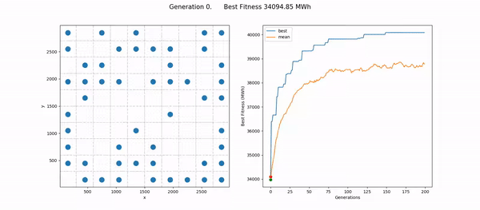

# Wind Farm Layout Optimization

An unoptimized or suboptimal layout of wind turbines in a wind farm can typically cost upto 10-15% of AEP (Annual Evergy Production), which will make the wind farm owner lose a large sum of money. This primarily happens due to the aggregated influence of arranged wind turbines on the wind speed and direction. This inter-turbine interference is known as wake effect.

Therefore, optimal layout of wind turbines in a wind farm carry huge business importance. Simultaneously, it also has the potential to steer the energy portfolio further towards sustainability and cleaner energy. Optimizing the layout of a wind farm in an interesting and complex optimization problem. The principal challenge arises due to the discontinuous nature of the search space induced by the wake effect of the turbines. Hence, optimizing the layout analytically is difficult. Although, off-the-shelf algorithms to solve the problem exist (typically based on stochastic or heuristic methods), newer models to evaluate a farm layout and newer constraints emerge, demanding more sophistication from the algorithms.

## Jensen Wake Model Velocity Profiles

**What is Wake effect**

 The wake effect is the aggregated influence on the energy production of the wind farm, which results from the changes in wind speed, pressure profile and turbulence caused by the impact of the turbines on each other. It is important to consider wake effects from neighboring wind farms and the possible impact of wind farms which will  be built in the future.

Jensen model is an analytical engineering wake model derived from the law of mass-conservation. Its original purpose was to increase the efficiency of wind clusters through layout optimization to reduce wake losses.

## Results from Genetic Algorithm

**Conclusions**

- Is suboptimal. can be improved
  - edit.
- Pushes majority of turbines to boundaries. 
  - perhaps refining grid can help

